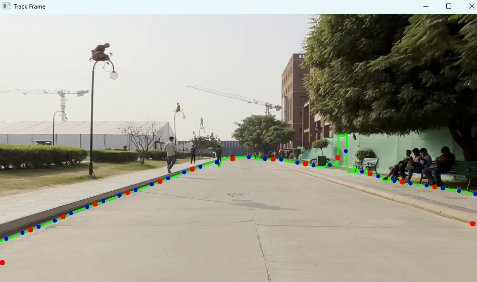
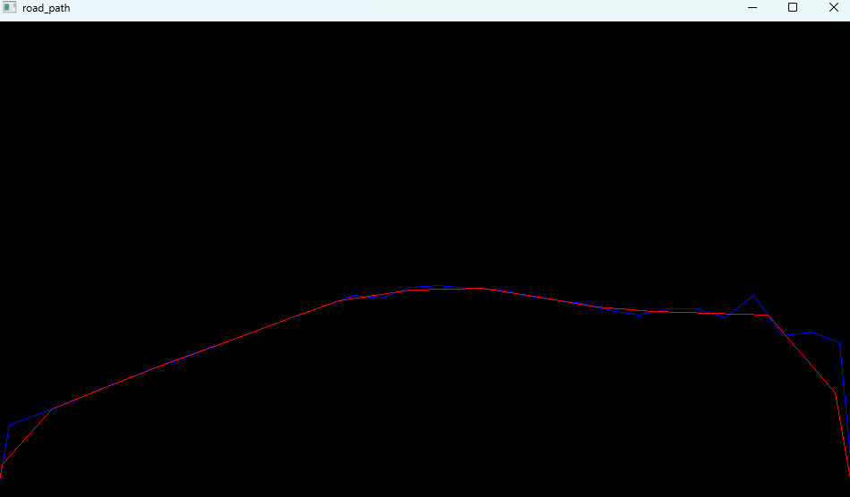
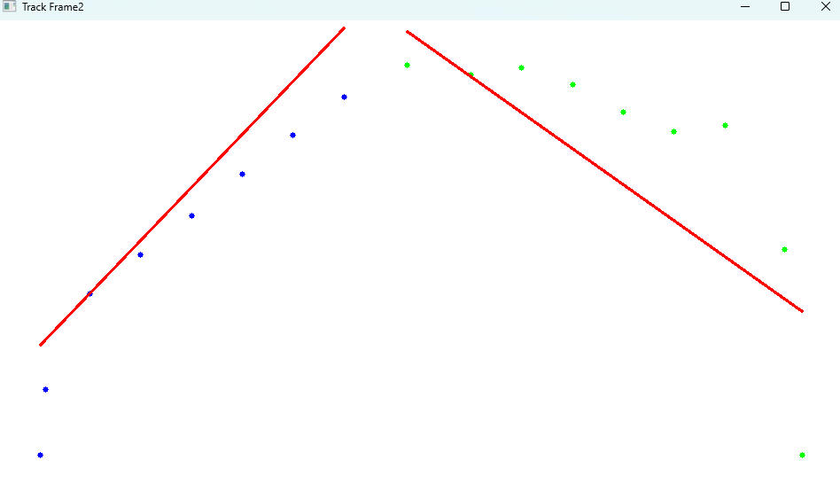

# CV Road Tracker

Real-time lane detection system using OpenCV. Processes webcam input with edge detection to identify and visualize road paths. Features GPU acceleration and multi-stage processing for reliable tracking.

## Features

- Real-time edge detection and road boundary identification
- Multi-stage processing pipeline for reliable path tracking
- GPU acceleration when available
- Visualization of detected paths and tracking points
- Adaptive filtering of detected components

## Screenshots

### Track Frame Visualization

*Track Frame shows the raw camera input with detected lane boundaries (green lines) and tracking points (red/blue dots)*

### Road Path Extraction

*Road Path extracts the detected boundaries as lines for navigation purposes*

### Processed Output

*Final processing stage with best-fit lines for potential navigation*

## Requirements

- Python 3.6+
- OpenCV
- NumPy

## Installation

```bash
# Clone this repository
git clone https://github.com/yourusername/cv-road-tracker.git

# Navigate to project directory
cd cv-road-tracker

# Install dependencies
pip install -r requirements.txt
```

## Usage

```bash
# Run using webcam input
python main.py
```

```bash
# Run for testing
python main_testing.py
```

Press 'q' to exit the application.

## Implementation Details

The system works through multiple processing stages:
1. Edge detection using Canny algorithm
2. Connected component analysis to filter noise
3. Bottom pixel detection to identify road boundaries
4. Clustering and centroid calculation to create tracking points
5. Path fitting for smooth navigation guidance

## Future Improvements

- [ ] Implement path prediction for smoother tracking
- [ ] Add configuration options for different environments
- [ ] Improve performance on low-powered devices
- [ ] Add support for recorded video input

## License

MIT

